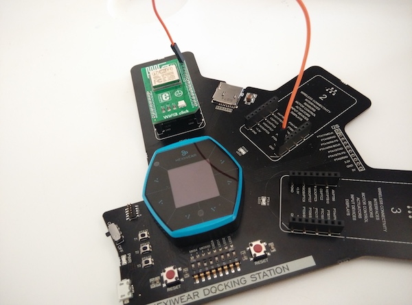
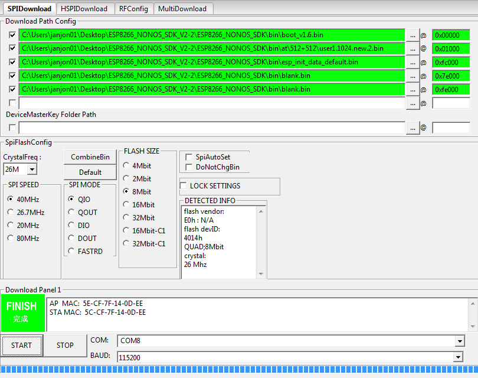

# hexiwear-cloud

Demonstration of connecting Hexiwear to mbed Device Connector.

## Usage

1. Enter your WiFi credentials in ``mbed_app.json``.
1. Get a device certificate from http://connector.mbed.com and save it as ``security.h``.
1. Build and flash in the [mbed online compiler](http://developer.mbed.org/compiler/#nav:/;) or via [mbed CLI](https://github.com/armmbed/mbed-cli).

## Updating the Wifi3 Click

To use the Wifi3 Click with this example, you'll need to update the firmware on the chip.

1. Place the module in socket 1 on your Hexiwear docking station.
1. Connect a wire from GND to pin GPIO0 on the Wifi3 Click.
    
1. Load [this firmware](img/serial-passthrough-hexiwear-115200.bin) on your Hexiwear.
1. Unpower your Hexiwear and power back on (make sure the wire from GND to GPIO0 is connected).
1. Download and run the [ESP Flash Download Tool](http://bbs.espressif.com/viewtopic.php?f=5&t=433) (Windows only, but works in a VM too).
1. Download the [ESP8266 NONOS SDK](http://bbs.espressif.com/viewtopic.php?f=46&t=2451) and unpack it somewhere.
1. In the ESP Flash Download tool select the following options:
    
1. Hit 'START'.
    * This might fail every now and then, just power cycle the board and try again.
1. After flashing is complete, power cycle your board and remove the wire from GND->GPIO0.
1. With the board running remove the Wifi3 Click module, and put it back in socket 1.
1. Build and flash this program.
